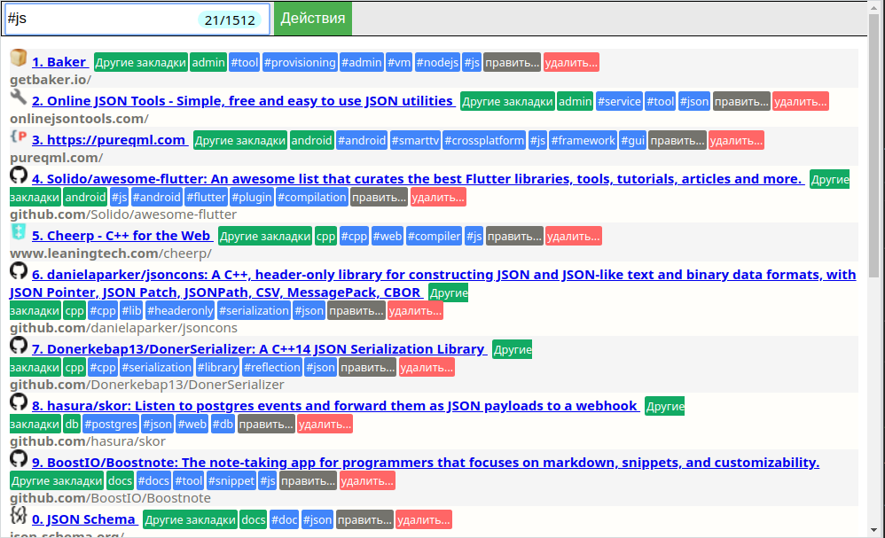

# Simple chrome bookmark finder

Performs search by tag, title part or bookmark folder name.

**Not intended to replace bookmark manager**

## Installing

Install from Chrome's [extension store](https://chrome.google.com/webstore/detail/bookmark-tags/edpeidcfjfmepdgdjnodefckgdjbigem) or
clone repository and install as unpacked extension.

## General info

Tags are part of a title (`... #tag1 #tag2`).

To search for exact tag use `#tag#`.

Shortcuts:

* `Ctrl + Enter` - open all visible bookmarks
* `Ctrl + n` - open n-th visible bookmark

## License

This project is licensed under the MIT License - see the LICENSE.md file for details.

## Contributing

Create issue/PR on project's page on github.com.

## Credits

Icon made by Freepik from www.flaticon.com.
